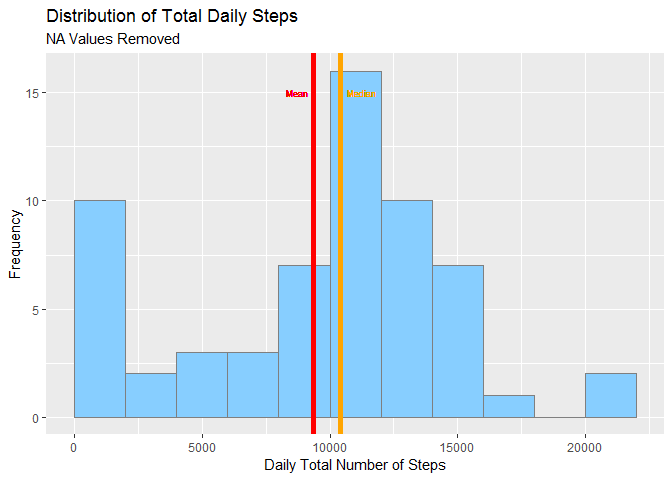
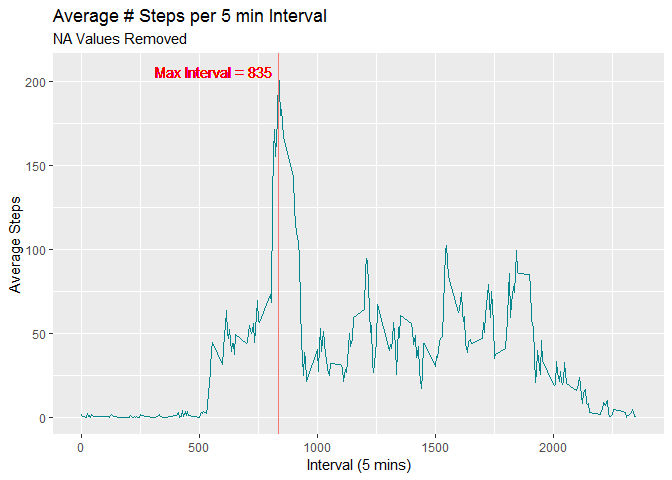
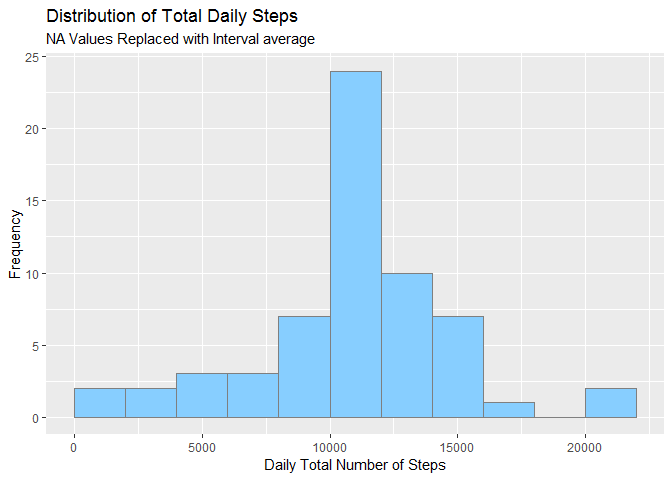
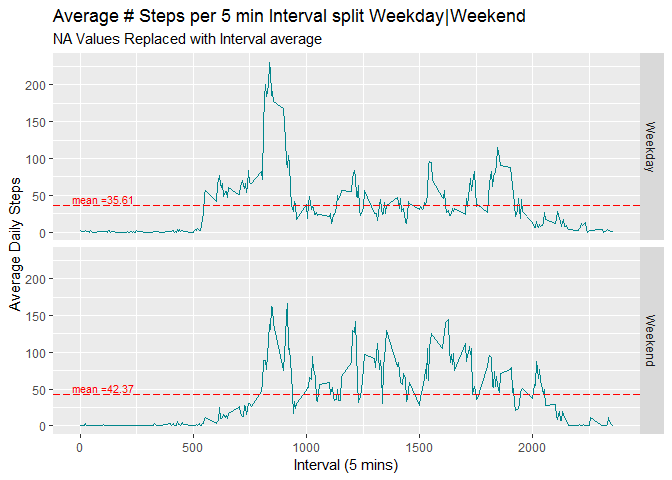

## Introduction
It is now possible to collect a large amount of data about personal movement using activity monitoring devices such as a Fitbit, Nike Fuelband, or Jawbone Up. These type of devices are part of the "quantified self" movement - a group of enthusiasts who take measurements about themselves regularly to improve their health, to find patterns in their behavior, or because they are tech geeks. But these data remain under-utilized both because the raw data are hard to obtain and there is a lack of statistical methods and software for processing and interpreting the data.

This assignment makes use of data from a personal activity monitoring device. This device collects data at 5 minute intervals through out the day. The data consists of two months of data from an anonymous individual collected during the months of October and November, 2012 and include the number of steps taken in 5 minute intervals each day.

## Packages Required
In order for the Markdown code to run successfully you will need to have the following package(s) installed:

- ggplot2
- dplyr
- knitr


We will also set the global options value `scipen` to avoid output values in scientific format in the document.

```r
#LOAD PACKAGES
library(ggplot2)
library(dplyr)
library(knitr)
options(scipen=999)
```

## Data

The data for this assignment can be downloaded from the course web site:

Dataset: [Activity monitoring data](https://d396qusza40orc.cloudfront.net/repdata%2Fdata%2Factivity.zip)

The variables included in this dataset are:

* **steps**: Number of steps taking in a 5-minute interval (missing values are coded as NA)
* **date**: The date on which the measurement was taken in YYYY-MM-DD format
* **interval**: Identifier for the 5-minute interval in which measurement was taken

The dataset is stored in a comma-separated-value (CSV) file and there are a total of 17,568 observations in this dataset.

You can also fork / clone the [Github Repository For this assignment](http://github.com/rdpeng/RepData_PeerAssessment1) to obtain data for this analysis.

## Loading and preprocessing the data
Have assumed that if running the markdown document the user has downloaded the data from either of the links above and set their working directory in R to be the folder which contains the downloaded, unzipped *"activity.csv"* file. This can be done using the `setwd()` function. See `?setwd()` for help on this function.

- Load the data using the read.csv function


```r
#LOAD ACTIVITY DATA
setwd("F:/R Training/Course 5 - Reproducible Research/Course Project 1")

activityData <- read.csv("activity.csv", stringsAsFactors = F)
```

- View the data using `str()`, on doing this we can see that the format of the date field is character. 

```r
#LOAD ACTIVITY DATA
str(activityData)
```

```
## 'data.frame':	17568 obs. of  3 variables:
##  $ steps   : int  NA NA NA NA NA NA NA NA NA NA ...
##  $ date    : chr  "2012-10-01" "2012-10-01" "2012-10-01" "2012-10-01" ...
##  $ interval: int  0 5 10 15 20 25 30 35 40 45 ...
```
- So that we have this in date/time format for the upcoming analysis, we should convert the date field to a date format using the `as.POSIXct()` function.
- Then we can run `str()` again to check this is successful. 

```r
#CONVERT DATE FIELD TO DATE, CURRENTLY STRING
activityData$date <- as.POSIXct(activityData$date, format = "%Y-%m-%d")
#CHECK FORMAT HAS WORKED
str(activityData)
```

```
## 'data.frame':	17568 obs. of  3 variables:
##  $ steps   : int  NA NA NA NA NA NA NA NA NA NA ...
##  $ date    : POSIXct, format: "2012-10-01" "2012-10-01" ...
##  $ interval: int  0 5 10 15 20 25 30 35 40 45 ...
```
## What is mean total number of steps taken per day? Make a histogram of the total number of steps taken each day
A histogram of the daily number of steps will give us an overview of the distribution of number of steps. We will also include information on the mean and median number of steps taken per day.
The instructions in the assignment at this stage suggest that we should omit missing values.

First create a data frame using the `aggregate()` function, and rename the columns so they are intuative. 

Calculate the Min and Max value of steps in order to determine the breaks for the histogram


```r
steps_by_day <- with(activityData, aggregate(steps, by = list(date), FUN = sum, na.rm = T ))
#Names not intuative, so rename
names(steps_by_day) <- c("Date", "TotalSteps")

min(steps_by_day$TotalSteps)
```

```
## [1] 0
```

```r
max(steps_by_day$TotalSteps)
```

```
## [1] 21194
```
Calculate the Mean and Median total number of steps. We can report these and also include them on the histogram showing the distribution of the number of steps


```r
meansteps <- mean(steps_by_day$TotalSteps)
mediansteps <- median(steps_by_day$TotalSteps)
```
So mean number of steps per day is **9354** and median number of steps per day is **10395** . 

Next we plot the histogram of the total number of steps per day, I've used package `ggplot2()` for this. You may need to install this package as instructed earlier in the document. I have also plotted lines displaying both the <span style="color:red">mean</span> and the <span style="color:orange">median</span> values of the daily number of steps. 


```r
StepPlot <- ggplot(data = steps_by_day, aes(steps_by_day$TotalSteps))
StepPlot + geom_histogram(breaks=seq(0, to =22000, 2000), col = "grey50", fill = "skyblue1") +
    ggtitle("Distribution of Total Daily Steps", subtitle = "NA Values Removed") +
    xlab("Daily Total Number of Steps") +
    ylab("Frequency") +
    geom_vline(aes(xintercept = mean(steps_by_day$TotalSteps)),col='red',size=2) +
    geom_vline(aes(xintercept = median(steps_by_day$TotalSteps)),col='orange',size=2)+
    geom_text(aes(label="Mean",y=15,x=mean(steps_by_day$TotalSteps)),hjust=1.25,col='red',size=2.5)+
    geom_text(aes(label="Median",y=15,x=median(steps_by_day$TotalSteps)),hjust=-0.25,col='orange',size=2.5)
```




## What is the average daily activity pattern?
In order to look at the average daily activity pattern, we'll first look at a time series plot of the 5 minute interval (x-axis) and the average number of steps taken, average across all days (y-axis)  

As a start point we need to aggregate the data by interval rather than by date as we did in the previous section, again we will use the `aggregate()` function. 


```r
steps_by_interval <- with(activityData, aggregate(steps, by = list(interval), FUN = mean, na.rm = T ))

#Names not intuative, so rename
names(steps_by_interval) <- c("Interval", "DailySteps")
```

We then want to use a very simple plot using `ggplot2()` package to show the time series of the 5 minute Intervals and number of steps at each interval.

We also need to work out which 5-minute interval, on average across all the days in the dataset, contains the maximum number of steps. We will also include this value on the time series.


```r
maxSteps <- steps_by_interval[which(steps_by_interval$DailySteps == max(steps_by_interval$DailySteps)), 1]

IntervalPlot <- ggplot(data = steps_by_interval, aes(x = steps_by_interval$Interval, y = steps_by_interval$DailySteps))
IntervalPlot + geom_line(color = "turquoise4", show.legend = F) + 
    ggtitle("Average # Steps per 5 min Interval", subtitle = "NA Values Removed") + 
    xlab("Interval (5 mins)")+ylab("Average Steps") + 
    geom_vline(aes(xintercept = maxSteps, col = "red"), show.legend = FALSE) + 
    geom_text(aes(label = paste0("Max Interval = ", maxSteps), y = max(steps_by_interval$DailySteps), x = maxSteps), hjust = 1.05, col = "red", size = 4)
```



The interval which contains the maximum number of steps is **835**.This is computed using the code above to calculate maxSteps.

## Inputting Missing Values
One of the problems posed in this project is to dealing with missing values where data is coded NA. This may introduce some bias into the analysis.

First we will check how many missing values there are in the data set and what percentage that is of the total data set.


```r
sum(is.na(activityData$steps))
```

```
## [1] 2304
```

```r
round(sum(is.na(activityData$steps))/nrow(activityData)*100,2)
```

```
## [1] 13.11
```

So in total there are **2304** missing values in the data set which comprises a total percentage of **13.11** of the data.

Now to come up with an appropriate way for filling in the blanks. A sensible approach seems to be to replace the NA's with the mean for that 5-minute interval.

Create a copy of the original dataset, so as not to overwrite original data. Use a loop to loop through the data checking if the value is NA, if so find the corresponding interval. Then take the average of this interval from the steps_by_interval data calculated above.

Finally do a quick check to ensure that the new data set now no longer has na values in it.


```r
activityData_na <- activityData

for (i in 1:nrow(activityData_na)) {
  if (is.na(activityData_na$steps[i])) {
    interval_value <- activityData_na$interval[i]
    steps_value <- steps_by_interval[steps_by_interval$Interval == interval_value,]
    activityData_na$steps[i] <- steps_value$DailySteps
  }
}

sum(is.na(activityData_na$steps))
```

```
## [1] 0
```

Now with the new dataset with the NA values replaced - calculate the new aggregated mean values, and plot this data on a histogram.


```r
new_steps_by_day <- with(activityData_na, aggregate(steps, by = list(date), FUN = sum, na.rm = T ))
#Names not intuative, so rename
names(new_steps_by_day) <- c("Date", "TotalSteps")

NewStepPlot <- ggplot(data = new_steps_by_day, aes(new_steps_by_day$TotalSteps))
NewStepPlot + geom_histogram(breaks=seq(0, to =22000, 2000), col = "grey50", fill = "skyblue1") +
  ggtitle("Distribution of Total Daily Steps", subtitle = "NA Values Replaced with Interval average") +
  xlab("Daily Total Number of Steps") +
  ylab("Frequency")
```



Now we calculate the revised mean and median of the dataset where we have replaced the missing values:


```r
newmean <- mean(new_steps_by_day$TotalSteps)
newmedian <- median(new_steps_by_day$TotalSteps)
```

Of the revised data set with NA values replaced the mean number of steps per day is **10766** and median number of steps per day is **10766**.


The mean value has increased from **9354** to **10766** while the median has increased from **10395** to **10766**. Since the mean is equal to the median and the median is a non integer value, it implies that the method of replacing NAs has left the mean and median equal ie. median value is an average value, this makes intuative sense since earlier we found that 13.11% of the data was NAs. Also since the mean has increased this implied that the NA values occurred in intervals where typically the wearer of the tracker was more active.

## Are there differences in activity patterns between weekdays and weekends?
A further topic of interest is the average number of steps taken in 5 minute intervals across weekdays and weekends, to see if these differ. For this part of the analysis the `weekdays()` function will be used.
We will use the dataset with the NAs replaced with mean of the interval data. 

The first step is to create a new factor to identify if the record is a weekday or weekend. 

```r
activityData_na$DayType <- ifelse(weekdays(activityData$date) %in% c("Saturday", "Sunday"), "Weekend", "Weekday")
#CHECK TO SEE IF SPLIT MAKES SENSE
table(activityData_na$DayType)
```

```
## 
## Weekday Weekend 
##   12960    4608
```

Next we create two subsets, one containing the weekend and one containing the weekday data:


```r
wkday <- filter(activityData_na, DayType == "Weekday")
wknd <- filter(activityData_na, DayType == "Weekend")
```
Then we group each of these subsets by the intervals and calculate the mean number of steps for each interval. Recombine the 2 datasets at the end. We also calculate the overall average no of steps per day for each of the 2 day types(weekdays or weekends)

```r
 wknd <- wknd %>% group_by(interval) %>% summarize(MeanSteps = mean(steps))
 wknd$DayType <- "Weekend"
 wkday <- wkday %>% group_by(interval) %>% summarize(MeanSteps = mean(steps))
 wkday$DayType <- "Weekday"
 
 new_steps_by_interval <- rbind(wknd, wkday)
 
 avg_by_day_type <- aggregate(steps ~ DayType, data = activityData_na, mean)
```
Now we will make a panel plot using ggplot2 to show the time series plot of the 5 minute intervals (x-axis) and average number of steps taken across all weekday days and weekend days (y-axis).


```r
#First make the weekend/weekday indicator a "factor"
new_steps_by_interval$DayType <- as.factor(new_steps_by_interval$DayType)

#Then set up the plot of the average mean steps per interval
DayTypePlot <- ggplot (new_steps_by_interval, aes (interval, MeanSteps))
DayTypePlot + geom_line(color = "turquoise4") + facet_grid (DayType~.) +
    ggtitle("Average # Steps per 5 min Interval split Weekday|Weekend", subtitle = "NA Values Replaced with Interval average") +
    xlab("Interval (5 mins)")+ylab("Average Daily Steps") +
    geom_hline(data = avg_by_day_type, aes(yintercept = steps), size = 0.5, color = "red", linetype ="longdash") + 
    geom_text(data = avg_by_day_type, mapping = aes(x=-Inf, y = avg_by_day_type$steps, label = paste0("mean =",round(avg_by_day_type$steps,2))),hjust = -0.3, vjust = -0.3, color = "red", size = 3)
```



We observe from this plot that, as expected, the activity profiles between weekdays and weekends greatly differ.We have shown the mean steps on the graphs, we can see here that the average steps per interval at the weekend is higher than during the weekdays. During the weekdays, activity peaks in the morning between 7 and 9 and then the activity remains below ~100 steps. In contrast, the weekend data does not show a period with particularly high level of activity, but the activity remains higher than the weekday activity at most times and in several instances it surpases the 100 steps mark and it is overall more evenly distributed throughout the day.

